## Step 1: Deploy Core Network

**Option A (Terminal):**
Click on the **Terminal button** to open the terminal then from the project root directory, execute the following command:

```bash
docker compose -f docker-compose.yml up -d
```

Executes Docker Compose to deploy core 5G network components (AMF, SMF, UPF, NRF, and others) in detached mode. Detached mode runs containers in the background, releasing the terminal session.

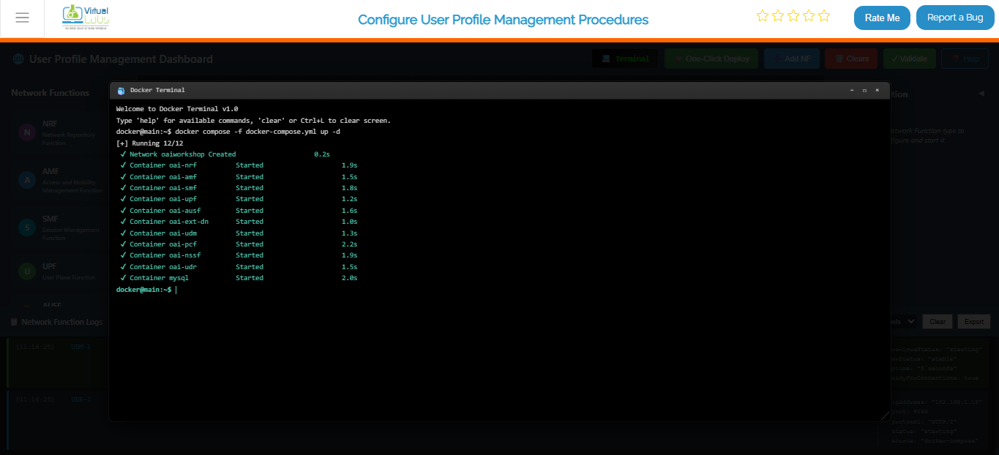

*Fig: Terminal output showing core network deployment with docker compose*

### Once the core network is up and running, deploy the gNB services:

```bash
docker compose -f docker-compose-gnb.yml up -d
```

Deploys the gNB (next-generation NodeB), the 5G radio access point. Upon startup, the gNB automatically registers with the core network, establishing connectivity for UE traffic.

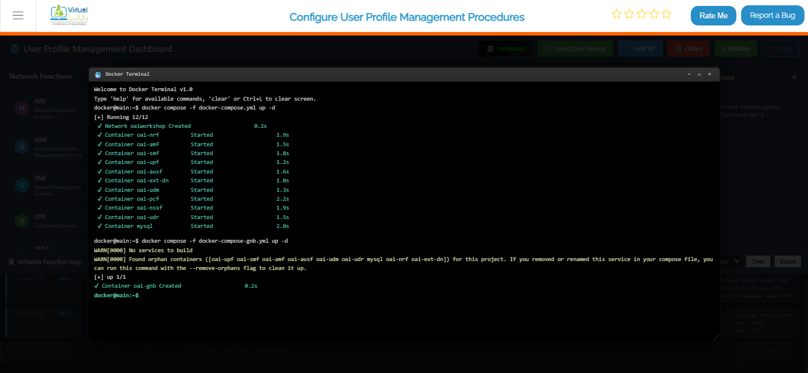

*Fig: Terminal output showing gNB deployment and connection to core network*

### After the gNB deployment is complete, deploy the UE services:

```bash
docker compose -f docker-compose-ue.yml up -d
```

Starts the UE (User Equipment) containers and attaches them to the gNB. The UE simulates devices (phones, IoT sensors) connecting to the 5G network. The containers perform the full registration and session setup flow.

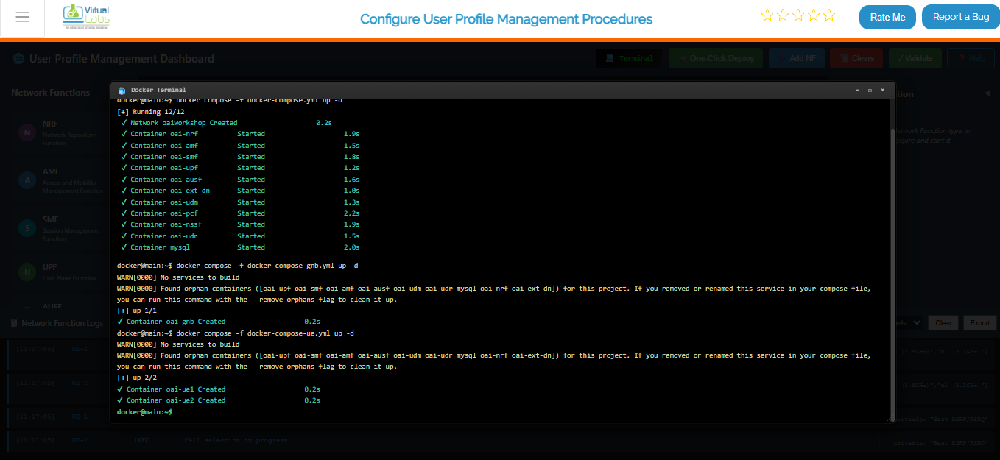

*Fig: Terminal output showing UE deployment and attachment to gNB*

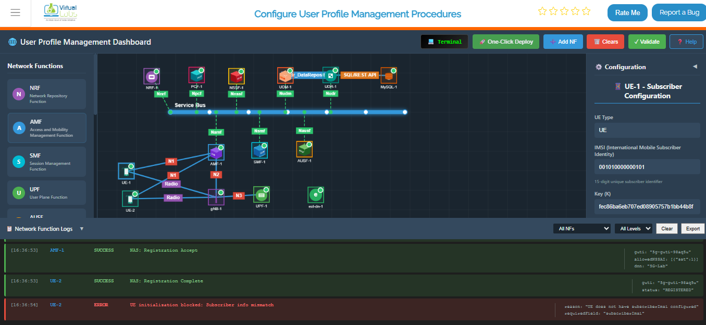

*Fig: Complete 5G network topology with UE, gNB, and all core network functions running*


### To verify that all containers are running successfully, execute:

```bash
docker ps
```

Lists all running Docker containers with status, ports, and names. A successful deployment shows core network, gNB, and UE containers with Up status.

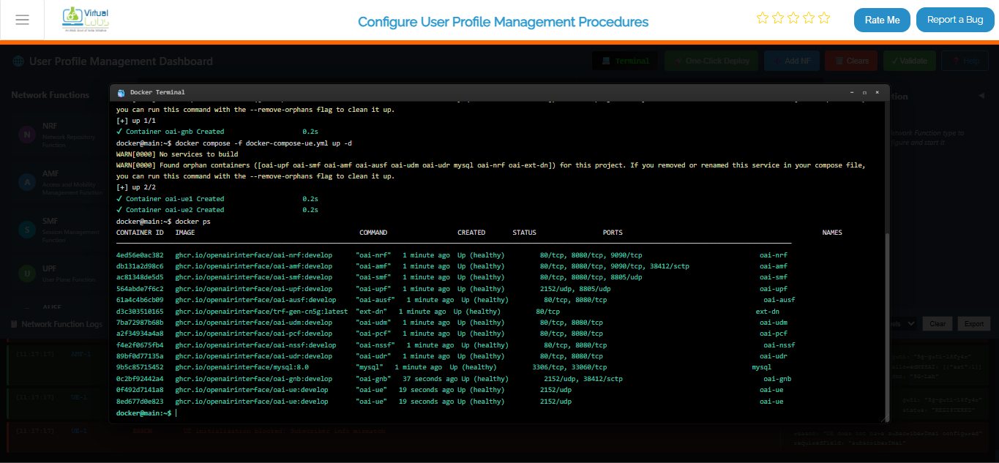

*Fig: Docker PS output listing all running 5G network containers with their status*

### To continuously monitor the status of the core network containers, use:

```bash
watch docker compose -f docker-compose.yml ps -a
```

Provides a continuously refreshing view of core network container status. The -a flag displays all containers, including stopped ones. Used for monitoring stabilization and detecting unexpected exits.

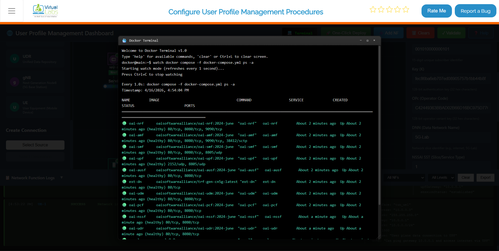

*Fig: Continuous real-time monitoring of core network container status*

## Option B: Manual Deployment

1. Add each required Network Function (NF) individually from the Network Function Panel.
2. Provide the necessary configuration parameters in the Configuration Panel on the left.
3. Start each Network Function after configuration.
4. Repeat until all required Network Functions are deployed and running.

Provides granular control over each Network Function. Enables selective deployment, individual configuration adjustments, and isolated troubleshooting.

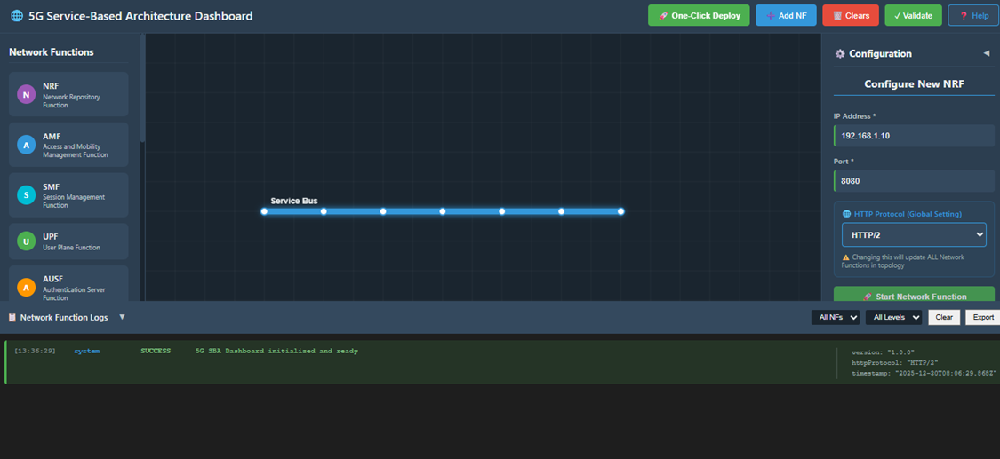

*Fig: Manual deployment of individual network functions via the Network Function Panel*

## Option C: Automatic Deployment (Recommended)

1. Click the One-Click Deploy button on the top toolbar.
2. Confirm the deployment when prompted.

Automates full 5G core deployment: clears existing topology, deploys components in sequence, and establishes interconnections. Recommended for demos, fresh environments, or rapid setup without manual intervention.

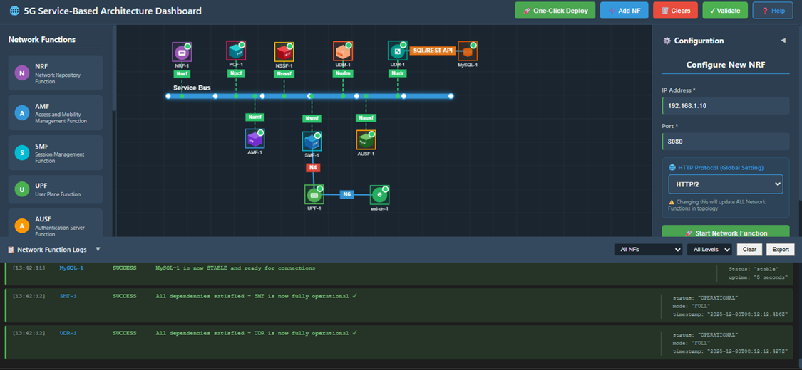

*Fig: One-click automatic deployment of the complete 5G core network topology*

### Observation:

- The system automatically clears any existing topology.
- The Service Bus is deployed first.
- All Network Functions (NRF, AMF, SMF, UPF, AUSF, UDM, PCF, NSSF, UDR) are deployed sequentially.
- Required interconnections are established automatically.
- Network Functions appear one by one on the topology view during deployment.

## Step 2: gNB Deployment

1. Select the gNB from the available components.
2. Enter a valid IP address and port number in the configuration panel.
3. Deploy and start the gNB.

The gNB is the bridge between your UEs and the 5G core. Make sure the IP and port you enter here match what your core network expects — a mismatch here is one of the most common reasons the gNB fails to register with the AMF.

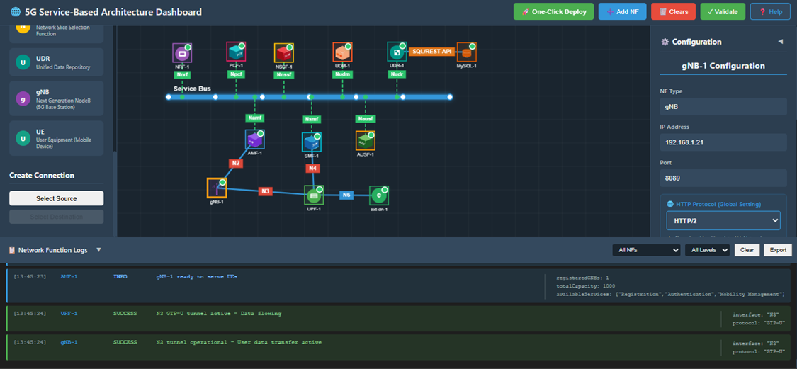

*Fig: gNB deployment with IP address and port configuration*

## Step 3: Verify UE Details in UDR

1. Select the UDR Network Function.
2. Click on Show Subscriber Info.
3. The system displays the list and quantity of registered UEs.
4. Select the UE you want to modify and click the Edit button.

Before a UE can connect, its subscription data needs to exist in the UDR (Unified Data Repository). This step lets you confirm that your UEs are already registered and gives you a chance to review or update their details before bringing them online.

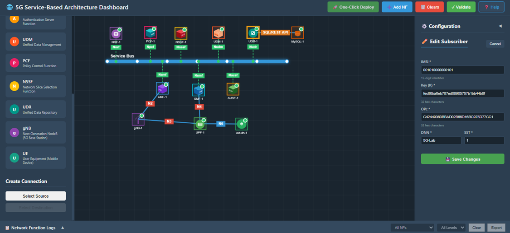

*Fig: UDR subscriber info panel showing list of registered UEs*

## Step 4: Modify UE Subscription Details

1. Update the required UE parameters.
   - For example, change the DNN from 5G-LAB to internet.
2. Save the updated configuration.
3. A notification is displayed confirming that the changes have been saved successfully.

Configures UE behavior parameters. The DNN (Data Network Name) specifies the target data network for traffic routing. For internet connectivity testing, set DNN to internet before starting the UE.

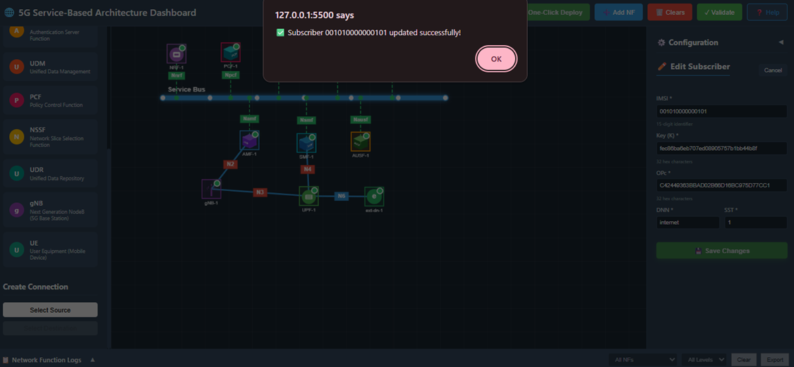

*Fig: UE subscription details updated with new DNN configuration*

## Step 5: Update and Start UE

1. Select the UE component.
2. Enter the UE configuration details exactly as updated in the UDR database.
3. Ensure all modified parameters are correctly reflected.
4. Start the UE.
5. Verify that the UE registers and operates successfully within the network.

Brings the UE online. The configuration must exactly match the UDR data; mismatches cause authentication and registration failure. A successful registration results in an active PDU session, indicating connectivity and traffic flow through the 5G core.

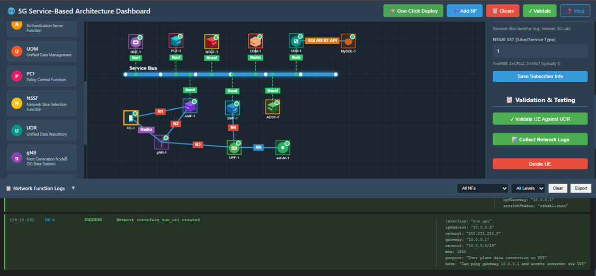

*Fig: UE successfully registered and connected to the 5G core network*
