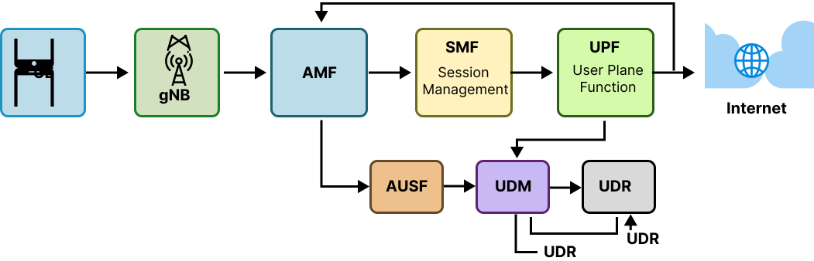
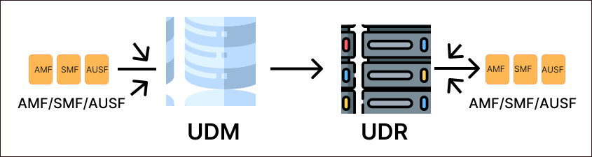
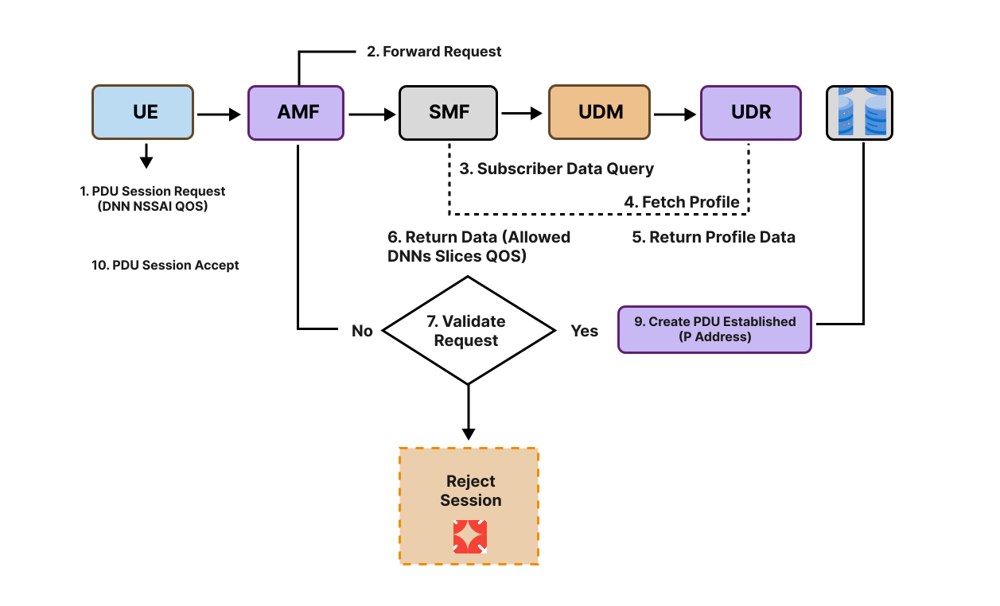

## 1. Introduction
In the 5G Core (5GC), every subscriber (UE) must be authenticated, authorized, and provisioned before they can receive services like internet access, voice, or IMS. To achieve this, the 5G system uses an advanced architecture where subscriber data is centrally stored, managed, and delivered to various network functions.

This entire data-handling process is called:

### User Profile Management
User Profile Management ensures that:
* The network knows who the user is
* What services the user is permitted to use
* What slices they belong to
* How they should be authenticated
* What data speeds and QoS levels they should receive
* Which DNN/APN (like "internet" or "ims") the user can access

To perform all of these tasks, 5G Core uses two major functions:
1. **UDM** – Unified Data Management
2. **UDR** – Unified Data Repository

Together, they form the backbone of subscriber management in the 5G Core.

<details>
<summary><strong>2. Why Subscriber Profile Management is Needed in 5G</strong></summary>



*Fig: 5G Core Network*

## 2. Why Subscriber Profile Management is Needed in 5G
5G Core is service-based, meaning each network function performs a specialized task. However, subscriber information is needed almost everywhere:

* AMF needs subscriber data during registration
* AUSF needs authentication vectors
* SMF needs DNN and slice permissions
* PCF uses subscriber data for policies
* UPF uses session-related data
* NSSF needs slice information

Without proper subscriber profile management:

| Failure | Reason |
|---------|--------|
| UE cannot register | Missing identity or authentication data |
| PDU session fails | SMF cannot find allowed DNN |
| Wrong slice selection | Missing S-NSSAI info |
| Incorrect QoS | Missing QoS profile |
| Authentication failure | Incorrect K/OPc keys |

Thus, subscriber profile management is fundamental to 5G Core operation.

</details>


<details>
<summary><strong>3. Understanding UDM & UDR</strong></summary>

## 3. Understanding UDM & UDR

### 3.1 What is UDM? (Unified Data Management)
UDM is like the central manager or brain that knows how subscriber data should be accessed and processed.

#### UDM Responsibilities (Very Detailed):

**A. Authentication & Security**
* Generates 5G-AKA authentication vectors
* Supports SUCI → SUPI decoding
* Interacts with AUSF during authentication
* Provides security-related data (K, OPc/OP, SQN)

**B. Access & Mobility Management**
* Provides AMF with information like:
  * Allowed access types
  * AMBR (maximum bit rate)
  * Roaming permissions
  * Registration restrictions
* Helps AMF decide whether UE is allowed to register

**C. Session Management**
* Provides SMF with session-related data:
  * Allowed DNN (APNs)
  * Session rules
  * Default DNN
  * Session continuity preference
  * IPv4/IPv6 allocation info

**D. Slice Management**
* Stores allowed S-NSSAIs (slice information)
* Helps NSSF select the right slice for UE

**E. Profile Update Handling**
* Accepts update requests from OSS/BSS
* Updates subscriber profile
* Sends notifications to subscribed NFs

**F. Subscription to Events**
* AMF and SMF can subscribe to profile update notifications
* UDM sends callbacks whenever subscriber data changes

### 3.2 What is UDR? (Unified Data Repository)
UDR is the central database that stores all subscriber information permanently.

#### UDR Responsibilities (In Depth):

**A. Persistent Storage**
Stores:
* SUPI/IMSI
* Authentication parameters (K, OP, OPc)
* Slice subscription data (S-NSSAI)
* DNN/APN lists
* QoS profiles
* User speed limits (AMBR)
* Policy-related data
* Subscription status (active/inactive)

**B. Data Access for All NFs**
Other NFs (UDM, PCF, SMF, NWDAF) can request data stored in UDR.

**C. Database Operations**
UDR supports:
* Create
* Read
* Update
* Delete

(Also known as CRUD operations)

**D. Data Consistency**
Ensures data is:
* Accurate
* Up-to-date
* Available for all NFs

**E. Supports High Availability**
UDR is built to handle millions of subscribers with extremely high reliability.



*Fig: UDM and UDR relationship*

</details>

<details>
<summary><strong>4. Relationship Between UDM and UDR</strong></summary>

## 4. Relationship Between UDM and UDR (Very Clear)
The relationship is very simple:

* **UDR stores the data**
* **UDM manages & provides the data**

Think of it like a college:
* **UDR** = College Database
* **UDM** = Office clerk or data manager
* **AMF/SMF/AUSF** = Departments that need student information

**Data Flow:**
```
Other NFs (AMF, SMF, AUSF, PCF)
        ↓
      UDM (Manager/Processor)
        ↓
      UDR (Database)
```

This centralized system ensures efficiency and correctness.

</details>

<details>
<summary><strong>5. What is a Subscriber Profile?</strong></summary>

## 5. What is a Subscriber Profile?
A subscriber profile is like a complete identity card + permission sheet for a UE in the 5G network.

It contains:

### 5.1 Identity Information
* **SUPI** (IMSI): Permanent identity
* **SUCI**: Encrypted identity sent over 5G air interface

### 5.2 Authentication Information
* Secret key **K**
* **OP/OPc**
* **SQN** (sequence number)
* Authentication method (5G-AKA or EAP-AKA')

### 5.3 Access & Mobility Subscription (AM Data)
Contains:
* Allowed access types (3GPP, non-3GPP)
* Roaming restrictions
* **AMBR** (uplink and downlink)
* Paging priority
* Registration area restrictions
* Operator policies

### 5.4 Session Management Subscription (SM Data)
Contains:
* List of allowed DNNs
* Default DNN
* Session policies
* IP allocation rules
* Session continuity preferences

Example DNN list:
* "oai"
* "internet"
* "ims"

### 5.5 Network Slice Subscription
Contains list of slices the UE is allowed to use:
* **SST** (slice service type)
* **SD** (slice differentiator)

### 5.6 QoS Subscription
Defines:
* **QoS class identifier** (5QI)
* **ARP** (Allocation and Retention Priority)
* Max bit rates
* Default QoS configuration

### 5.7 Subscription Status
* **ACTIVE**
* **SUSPENDED**
* **BARRED**

If status = **BARRED** → UE cannot register.

</details>

<details>
<summary><strong>6. How UDM/UDR Work During Registration</strong></summary>

## 6. How UDM/UDR Work During Registration
When the UE sends a Registration Request, AMF begins a chain of operations.

### Step-by-Step:

**Step 1: UE → AMF: Registration Request**
UE sends SUCI (encrypted SUPI).

**Step 2: AMF → UDM: Fetch subscriber data**
AMF requests:
* Identity info
* Allowed slices
* Allowed services
* Authentication data

**Step 3: UDM → UDR: Retrieve data**
UDM fetches all required data from UDR.

**Step 4: Authentication Initiation**
UDM prepares authentication vectors:
* RAND
* AUTN
* RES
* KSEAF

And sends them to AUSF.

**Step 5: AUSF → AMF**
AUSF replies with authentication response.

**Step 6: AMF finishes security procedure**
Security Mode Command is executed.

**Step 7: AMF applies access rules**
AMF checks:
* Is UE allowed on this PLMN?
* Any roaming restrictions?
* Any forbidden TACs?

**Step 8: Registration Accept**
UE is successfully registered.

</details>

<details>
<summary><strong>7. How UDM/UDR Work During PDU Session Establishment</strong></summary>


*Fig: 5G Registration procedure* 

## 7. How UDM/UDR Work During PDU Session Establishment
When UE wants internet:

**Step 1: UE → AMF: PDU Session Request**

**Step 2: AMF → SMF**

**Step 3: SMF → UDM**
SMF requests:
* Is this DNN allowed?
* Is slicing allowed?
* Is UE allowed PDUs?
* Are there QoS restrictions?

**Step 4: UDM → UDR**
Fetch SM subscription data.

**Step 5: SMF decision**
* If allowed → SMF creates session
* If not allowed → reject session immediately

</details>

<details>
<summary><strong>8. Importance of UDM/UDR in Real 5G Networks</strong></summary>

## 8. Importance of UDM/UDR in Real 5G Networks
In real telecom networks like Jio, Airtel, Verizon etc.:

* UDR stores millions of subscriber profiles
* UDM handles billions of authentication requests per day
* UDM ensures network security
* UDR ensures data consistency
* Subscriber changes (like plan upgrade) go through UDM/UDR

Without these two functions, the 5G network cannot operate.

</details>

<details>
<summary><strong>9. Real-Time Example</strong></summary>



*Fig: PDU Session Establishment with Subscriber Data Validation*


## 9. Real-Time Example
Imagine a user who has a plan that includes:

* Internet
* IMS VoLTE
* Slice for low latency gaming
* Unlimited data

This is stored as a subscriber profile inside UDR.

If the user upgrades their plan:
* Higher speed
* More slices
* More services

The operator updates the subscriber profile.

UDM fetches this updated profile and applies new permissions immediately when the UE registers again.

</details> 