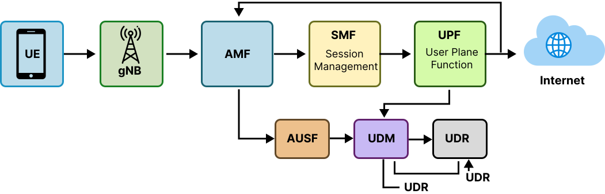
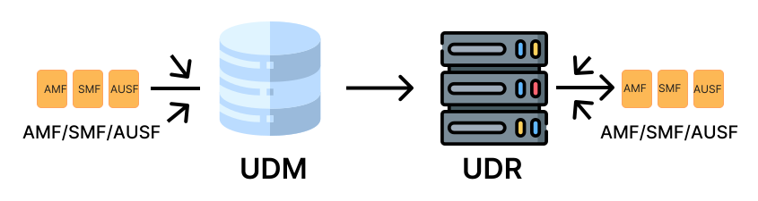
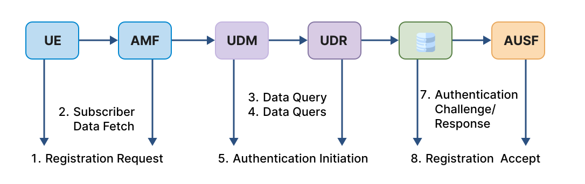
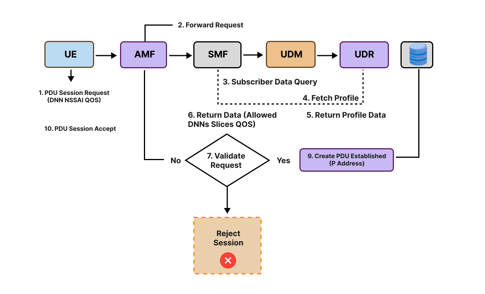

> **Audio Explanation:** For a comprehensive understanding of these theoretical concepts, you can listen on YouTube. 
> [**Click here to listen the audio**](https://youtu.be/H5OJX4uok-0)

## 1. Introduction
In the 5G Core (5GC), every subscriber (UE) must be authenticated, authorized, and provisioned before they can receive services like internet access, voice, or IMS. To achieve this, the 5G system uses an advanced architecture where subscriber data is centrally stored, managed, and delivered to various network functions.

This entire data-handling process is called:

### 1.1 User Profile Management
User Profile Management ensures that:
* The network knows who the user is
* What services the user is permitted to use
* What slices they belong to
* How they should be authenticated
* What data speeds and QoS levels they should receive
* Which DNN/APN (like internet or IMS) the user can access

To perform all of these tasks, 5G Core uses two major functions:
**UDM** – Unified Data Management
**UDR** – Unified Data Repository

Together, they form the backbone of subscriber management in the 5G Core.

## 2. Why Subscriber Profile Management is Needed in 5G

The 5G Core is built on a service-based architecture, meaning each network function performs a highly specialized task. As illustrated in **Figure 1**, this architecture relies on seamless interactions between various network functions (such as the AMF, SMF, and PCF) and the centralized data management entities (UDM and UDR). Because these functions are decoupled, subscriber information must be managed centrally yet be accessible across the entire network.

<div align="center">
  
  <p><em>Figure 1: 5G Core Network architecture, highlighting the central role of UDM and UDR in managing subscriber profiles.</em></p>
</div>

Specifically, different network functions depend on this subscriber data for their core operations:

* AMF needs subscriber data during registration
* AUSF needs authentication vectors
* SMF needs DNN and slice permissions
* PCF uses subscriber data for policies
* UPF uses session-related data
* NSSF needs slice information

Without proper subscriber profile management:

| Failure | Reason |
|---------|--------|
| UE cannot register | Missing identity or authentication data |
| PDU session fails | SMF cannot find allowed DNN |
| Wrong slice selection | Missing S-NSSAI info |
| Incorrect QoS | Missing QoS profile |
| Authentication failure | Incorrect K/OPc keys |

Thus, subscriber profile management is fundamental to 5G Core operation.

## 3. Understanding UDM & UDR

### 3.1 What is UDM? (Unified Data Management)
UDM is like the central manager or brain that knows how subscriber data should be accessed and processed.

#### UDM Responsibilities:

**A. Authentication & Security**
* Generates 5G-AKA authentication vectors
* Supports SUCI → SUPI decoding
* Interacts with AUSF during authentication
* Provides security-related data (K, OPc/OP, SQN)

**B. Access & Mobility Management**
* Provides AMF with information like:
  * Allowed access types
  * AMBR (maximum bit rate)
  * Roaming permissions
  * Registration restrictions
* Helps AMF decide whether UE is allowed to register

**C. Session Management**
* Provides SMF with session-related data:
  * Allowed DNN (APNs)
  * Session rules
  * Default DNN
  * Session continuity preference
  * IPv4/IPv6 allocation info

**D. Slice Management**
* Stores allowed S-NSSAIs (slice information)
* Helps NSSF select the right slice for UE

**E. Profile Update Handling**
* Accepts update requests from OSS/BSS
* Updates subscriber profile
* Sends notifications to subscribed NFs

**F. Subscription to Events**
* AMF and SMF can subscribe to profile update notifications
* UDM sends callbacks whenever subscriber data changes

### 3.2 What is UDR? (Unified Data Repository)
UDR is the central database that stores all subscriber information permanently.

- #### UDR Responsibilities:

**A. Persistent Storage**
Stores:
* SUPI/IMSI
* Authentication parameters (K, OP, OPc)
* Slice subscription data (S-NSSAI)
* DNN/APN lists
* QoS profiles
* User speed limits (AMBR)
* Policy-related data
* Subscription status (active/inactive)

**B. Data Access for All NFs**
Other NFs (UDM, PCF, SMF, NWDAF) can request data stored in UDR.

**C. Database Operations**
UDR supports:
* Create
* Read
* Update
* Delete

(Also known as CRUD operations)

**D. Data Consistency**
Ensures data is:
* Accurate
* Up-to-date
* Available for all NFs

**E. Supports High Availability**
UDR is built to handle millions of subscribers with extremely high reliability.

## 4. Relationship Between UDM and UDR

The architectural relationship between UDM and UDR is fundamental to the 5G Core's data management strategy, as depicted in **Figure 2**. While the UDR acts as the foundational, centralized database for persistently storing subscriber data, the UDM operates as the intelligent processing layer. It retrieves, manages, and delivers this data to other network entities that request it.

<div align="center">
  
  <p><em>Figure 2: The architectural separation and relationship between UDM (processing layer) and UDR (storage layer).</em></p>
</div>

To summarize this relationship simply:

* **UDR stores the data**
* **UDM manages & provides the data**

Think of it like a college:
* **UDR** = College Database
* **UDM** = Office clerk or data manager
* **AMF/SMF/AUSF** = Departments that need student information

This centralized system ensures efficiency and correctness.

## 5. What is a Subscriber Profile?

A subscriber profile is like a complete identity card + permission sheet for a UE in the 5G network.

It contains:

### 5.1 Identity Information
* **SUPI** (IMSI): Permanent identity
* **SUCI**: Encrypted identity sent over 5G air interface

### 5.2 Authentication Information
* Secret key **K**
* **OP/OPc**
* **SQN** (sequence number)
* Authentication method (5G-AKA or EAP-AKA')

### 5.3 Access & Mobility Subscription (AM Data)
Contains:
* Allowed access types (3GPP, non-3GPP)
* Roaming restrictions
* **AMBR** (uplink and downlink)
* Paging priority
* Registration area restrictions
* Operator policies

### 5.4 Session Management Subscription (SM Data)
Contains:
* List of allowed DNNs
* Default DNN
* Session policies
* IP allocation rules
* Session continuity preferences

Example DNN list:
* OAI
* Internet
* IMS

### 5.5 Network Slice Subscription
Contains list of slices the UE is allowed to use:
* **SST** (slice service type)
* **SD** (slice differentiator)

### 5.6 QoS Subscription
Defines:
* **QoS class identifier** (5QI)
* **ARP** (Allocation and Retention Priority)
* Max bit rates
* Default QoS configuration

### 5.7 Subscription Status
* **ACTIVE**
* **SUSPENDED**
* **BARRED**

If status = **BARRED** → UE cannot register.

## 6. How UDM/UDR Work During Registration

The registration procedure is the first critical step when a UE connects to the 5G network. **Figure 3** illustrates the step-by-step signaling flow during this procedure, showing how the UE initiates the request, and how the AMF collaborates with the UDM and AUSF to authenticate the user and retrieve the necessary subscription data.

<div align="center">
  
  <p><em>Figure 3: Step-by-step signaling flow during the 5G registration procedure.</em></p>
</div>

### Step-by-Step:

When the UE sends a Registration Request, AMF begins a chain of operations:

**Step 1: UE → AMF: Registration Request**
UE sends SUCI (encrypted SUPI).

**Step 2: AMF → UDM: Fetch subscriber data**
AMF requests:
* Identity info
* Allowed slices
* Allowed services
* Authentication data

**Step 3: UDM → UDR: Retrieve data**
UDM fetches all required data from UDR.

**Step 4: Authentication Initiation**
UDM prepares authentication vectors:
* RAND
* AUTN
* RES
* KSEAF

And sends them to AUSF.

**Step 5: AUSF → AMF**
AUSF replies with authentication response.

**Step 6: AMF finishes security procedure**
Security Mode Command is executed.

**Step 7: AMF applies access rules**
AMF checks:
* Is UE allowed on this PLMN?
* Any roaming restrictions?
* Any forbidden TACs?

**Step 8: Registration Accept**
UE is successfully registered.

## 7. How UDM/UDR Work During PDU Session Establishment

Once a UE is registered, it must establish a Protocol Data Unit (PDU) session to access data networks like the internet or IMS. **Figure 4** outlines this PDU session establishment process, emphasizing the critical step of subscriber data validation. During this phase, the SMF queries the UDM to verify user permissions, allowed Data Network Names (DNNs), and Quality of Service (QoS) policies before authorizing the session.

<div align="center">
  
  <p><em>Figure 4: PDU Session Establishment highlighting subscriber data validation via UDM/UDR.</em></p>
</div>

When the UE wants to connect to a network (e.g., for internet access), the following sequence occurs:

**Step 1: UE → AMF: PDU Session Request**

**Step 2: AMF → SMF**

**Step 3: SMF → UDM**
SMF requests:
* Is this DNN allowed?
* Is slicing allowed?
* Is UE allowed PDUs?
* Are there QoS restrictions?

**Step 4: UDM → UDR**
Fetch SM subscription data.

**Step 5: SMF decision**
* If allowed → SMF creates session
* If not allowed → reject session immediately

## 8. Importance of UDM/UDR in Real 5G Networks

In real telecom networks like Jio, Airtel, Verizon etc.:

* UDR stores millions of subscriber profiles
* UDM handles billions of authentication requests per day
* UDM ensures network security
* UDR ensures data consistency
* Subscriber changes (like plan upgrade) go through UDM/UDR

Without these two functions, the 5G network cannot operate.

## 9. Real-Time Example

To understand the practical impact of dynamic subscriber profile management, imagine a user who has a plan that includes:

* Internet
* IMS VoLTE
* Slice for low latency gaming
* Unlimited data

This is stored as a subscriber profile inside UDR.

If the user upgrades their plan:
* Higher speed
* More slices
* More services

The operator updates the subscriber profile.

UDM fetches this updated profile and applies new permissions immediately when the UE registers again.

## 10. Subscription Data Request Structure

When a network function (AMF, SMF, PCF, etc.) needs subscriber data, it does not query UDR directly in most deployments — it goes through **UDM**, which exposes standardized **Nudm** services, while UDM itself talks to UDR over the **Nudr** service-based interface. Both interfaces follow the same HTTP/2 REST/JSON pattern used across the 5G SBA.

### 10.1 Nudm Service Request (Consumer NF → UDM)

A typical request from AMF or SMF to UDM follows this structure:

**Request:**
```
GET /nudm-sdm/v2/{supi}/am-data
Host: udm.5gc.mnc001.mcc001.3gppnetwork.org
Accept: application/json
```

Common Nudm service operations include:

| Service Name | Purpose | Example Path |
|---|---|---|
| Nudm_SDM (Subscriber Data Management) | Fetch AM/SM/slice/QoS data | `/nudm-sdm/v2/{supi}/am-data` |
| Nudm_UEAU (UE Authentication) | Fetch authentication vectors | `/nudm-ueau/v1/{supi}/security-information/generate-auth-data` |
| Nudm_UECM (UE Context Management) | Register/update serving NF info | `/nudm-uecm/v1/{supi}/registrations/amf-3gpp-access` |
| Nudm_EE (Event Exposure) | Subscribe to profile change notifications | `/nudm-ee/v1/{supi}/subscriptions` |

**Key request parameters:**

- **supi** — the subscriber's permanent identifier (path parameter)
- **plmn-id** — serving PLMN, used to check roaming permissions
- **data-set-names** — which categories of data are requested (e.g., `AM`, `SM`, `SMF-SEL`, `TRACE`)
- **supported-features** — negotiates optional feature support between NF and UDM

### 10.2 Nudr Service Request (UDM → UDR)

UDM translates the above into a lower-level **Nudr_DataRepository** request:

**Request:**
```
GET /nudr-dr/v2/subscription-data/{supi}/context-data/amf-3gpp-access
Host: udr.5gc.mnc001.mcc001.3gppnetwork.org
Accept: application/json
```

**Example successful response body:**
```json
{
  "supi": "imsi-001010000000001",
  "gpsis": ["msisdn-919999999999"],
  "subscribedUeAmbr": {
    "uplink": "100 Mbps",
    "downlink": "500 Mbps"
  },
  "nssai": {
    "defaultSingleNssais": [
      { "sst": 1, "sd": "000001" }
    ]
  },
  "ratRestrictions": [],
  "forbiddenAreas": []
}
```

### 10.3 Request Flow Summary

```
AMF/SMF/PCF  --(Nudm request)-->  UDM  --(Nudr request)-->  UDR
                                                                |
AMF/SMF/PCF  <--(Nudm response)--  UDM  <--(Nudr response)----
```

UDM effectively acts as a translation and aggregation layer: it converts service-specific Nudm queries into generic Nudr data-repository queries, and can combine multiple UDR lookups into a single Nudm response when a consumer NF asks for several data-set-names at once.

## 11. Failure Handling in UDM/UDR Interactions

Like all 5GC service-based interfaces, Nudm and Nudr calls can fail. The 5G Core uses standardized **HTTP status codes** and **3GPP "ProblemDetails" JSON objects** (per 3GPP TS 29.500/29.503) so that any consumer NF can interpret a failure consistently.

### 11.1 Common Failure Causes

- **Subscriber not found** — SUPI does not exist in UDR
- **Data set not found** — subscriber exists but requested data category (e.g., SM data for a specific DNN) is missing
- **Subscription status barred/suspended** — profile exists but is not active
- **UDR unreachable** — network or timeout failure between UDM and UDR
- **Malformed request** — missing mandatory parameters (e.g., no `supi`, invalid `plmn-id`)
- **Roaming not permitted** — PLMN in the request does not match allowed roaming areas
- **Resource conflict** — concurrent profile update collides with a read/write operation

### 11.2 Standardized Error Response Format

Failures are returned using an HTTP error status code along with a JSON **ProblemDetails** body:

```json
{
  "type": "urn:3gpp:error:USER_NOT_FOUND",
  "title": "Subscriber not found",
  "status": 404,
  "cause": "USER_NOT_FOUND",
  "detail": "No subscriber record exists for the given SUPI"
}
```

**Common status codes used:**

| HTTP Status | Meaning | Typical Cause Value |
|---|---|---|
| 400 | Bad Request | `MANDATORY_IE_MISSING`, `INVALID_MSG_FORMAT` |
| 403 | Forbidden | `ROAMING_NOT_ALLOWED`, `SUBSCRIPTION_BARRED` |
| 404 | Not Found | `USER_NOT_FOUND`, `DATA_NOT_FOUND` |
| 409 | Conflict | `RESOURCE_ALREADY_EXISTS` |
| 500 | Internal Server Error | `UNSPECIFIED_ERROR` |
| 503 | Service Unavailable | `UDR_UNAVAILABLE`, congestion |

### 11.3 Impact on Downstream Procedures

A UDM/UDR failure during registration or session establishment propagates upward and results in a corresponding rejection to the UE:

- Failure during **AM data fetch** → AMF sends **Registration Reject** with an appropriate 5GMM cause (e.g., "Illegal UE" or "PLMN not allowed")
- Failure during **SM data fetch** → SMF sends **PDU Session Establishment Reject** (see Section 8) since it cannot validate DNN/slice permissions
- Failure during **authentication vector generation** → AUSF/AMF abort the authentication procedure and the UE registration fails

### 11.4 Retry and Resilience Behavior

- **UDM-side retry**: If UDR does not respond within the configured timeout, UDM retries the Nudr request a limited number of times before returning a 503 to the calling NF.
- **NRF-assisted failover**: If a specific UDR/UDM instance is unreachable, NRF can direct the caller to an alternate instance serving the same subscriber range.
- **Idempotent reads**: GET-based Nudm/Nudr operations are safe to retry directly, since they do not modify state.
- **Non-idempotent writes**: Profile update (PUT/PATCH) operations use conditional headers (e.g., `If-Match` with resource versioning) to avoid overwriting concurrent changes on retry.
- **Circuit breaking**: Consumer NFs (AMF/SMF) may temporarily stop sending requests to a UDM instance that is repeatedly failing, falling back to NRF discovery to locate a healthy instance.

### 11.5 Best Practices

- Deploy UDR with **geo-redundant replicas** so a single-site failure does not block subscriber lookups network-wide.
- Keep **timeout and retry counts** conservative to avoid amplifying load during a UDR outage.
- Use **event subscription (Nudm_EE)** instead of repeated polling, reducing unnecessary load and the chance of failure during peak registration periods.
- Log **cause codes** (not just HTTP status) to distinguish subscriber-specific issues (e.g., barred) from systemic ones (e.g., UDR outage).