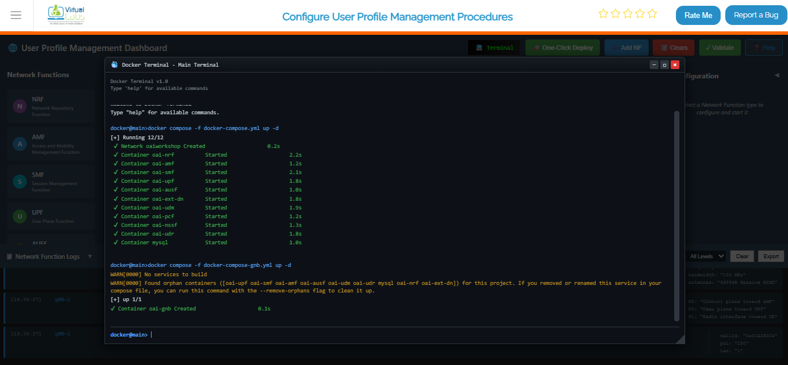
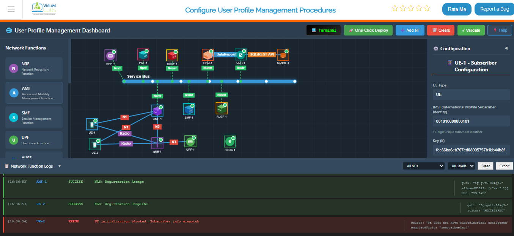
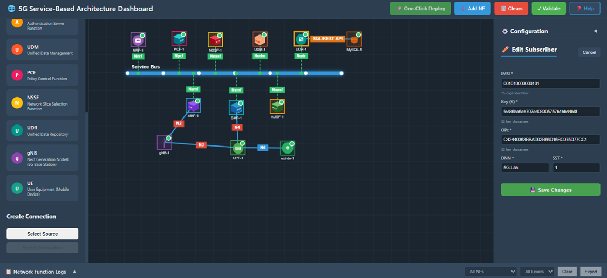

## Step 1: Deploy Core Network

**Option A (Terminal):**
Click on the **Terminal button** to open the terminal then from the project root directory, execute the following command:


This command starts all core network components (AMF, SMF, UPF, NRF, etc.) in detached mode

```bash
docker compose -f docker-compose.yml up -d
```


# Once the core network is up and running, deploy the gNB services:

```bash
 docker compose -f docker-compose-gnb.yml up -d
 ```
This command initializes the gNB and establishes connectivity with the core network.




# After the gNB deployment is complete, deploy the UE services:


```bash
docker compose -f docker-compose-ue.yml up -d
```
This starts the UE containers and attaches them to the gNB.





# To verify that all containers are running successfully, execute:

```bash
docker ps
```


# To continuously monitor the status of the core network containers, use:

```bash
watch docker compose -f docker-compose.yml ps -a
```


### Option B: Manual Deployment

1. Add each required Network Function (NF) individually from the Network Function Panel.
2. Provide the necessary configuration parameters in the Configuration Panel on the left.
3. Start each Network Function after configuration.
4. Repeat the above steps until all required Network Functions are successfully deployed and running.


### Option C: Automatic Deployment (Recommended)

1. Click the One-Click Deploy button on the top toolbar.
2. Confirm the deployment when prompted.


### Observation:

- The system automatically clears any existing topology.
- The Service Bus is deployed first.
- All Network Functions (NRF, AMF, SMF, UPF, AUSF, UDM, PCF, NSSF, UDR) are deployed sequentially.
- Required interconnections are established automatically.
- Network Functions appear one by one on the topology view during deployment.

## Step 2: gNB Deployment

1. Select the gNB from the available components.
2. Enter a valid IP address and port number in the configuration panel.
3. Deploy and start the gNB.


## Step 3: Verify UE Details in UDR

1. Select the UDR Network Function.
2. Click on Show Subscriber Info.
3. The system displays the list and quantity of registered UEs.
4. Select the UE you want to modify and click the Edit button.



## Step 4: Modify UE Subscription Details

1. Update the required UE parameters.
   - For example, change the DNN from 5G-LAB to internet.
2. Save the updated configuration.
3. A notification is displayed confirming that the changes have been saved successfully.


## Step 5: Update and Start UE

1. Select the UE component.
2. Enter the UE configuration details exactly as updated in the UDR database.
3. Ensure all modified parameters are correctly reflected.
4. Start the UE.
5. Verify that the UE registers and operates successfully within the network.

